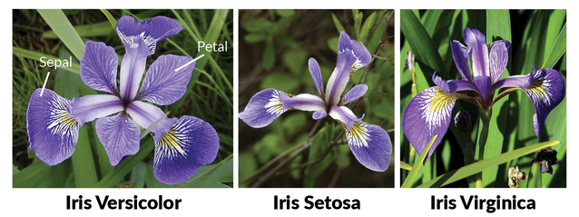

# Iris Problem
___

## Solving the Iris classification problem using:

> [Traditional Machine Learning **Classification** Algorithms](classification.ipynb)

> [Traditional Machine Learning **Clustering** Algorithms - TODO]()

> [Neural Networks - TODO]()